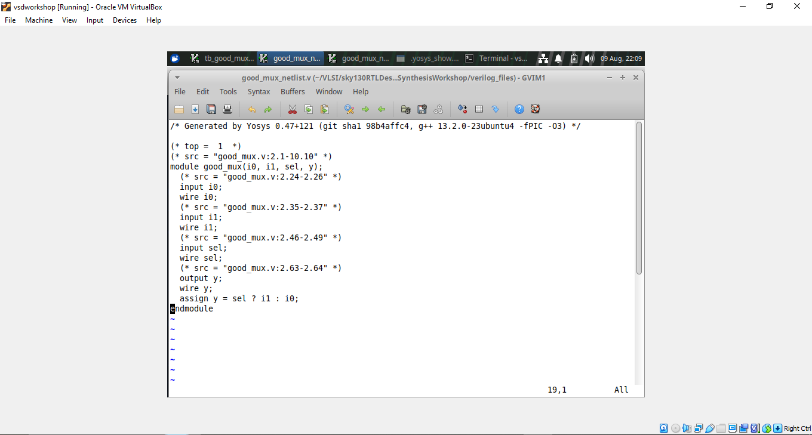
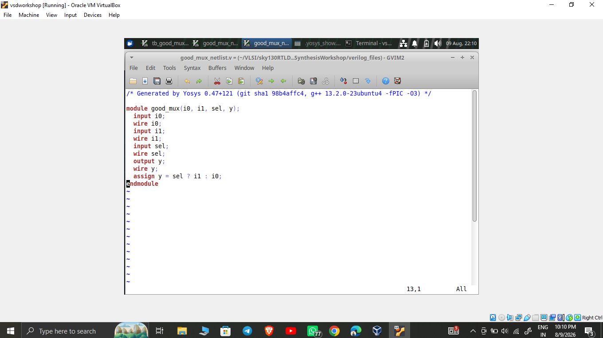
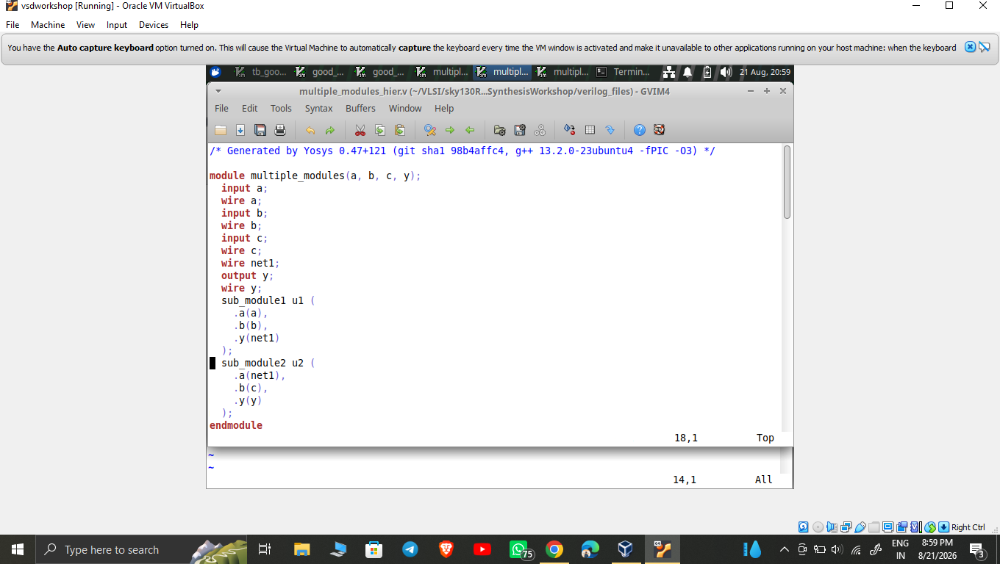
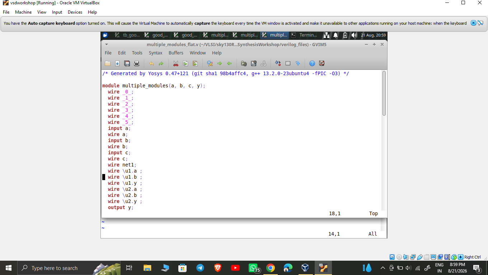

# Week 1 – Introduction to Liberty Files & RTL Simulation

This week covers the fundamentals of RTL design, simulation, and synthesis using **Icarus Verilog**, **GTKWave**, and **Yosys** with the **SKY130** standard cell Liberty library. It walks through two examples: a simple 2:1 multiplexer (`good_mux`) for simulation and synthesis basics, and a `multiple_modules` design used to demonstrate **hierarchical vs. flattened synthesis**.

---

## 📑 Table of Contents

- [Overview](#overview)
- [Part A — Simulating and Synthesizing `good_mux`](#part-a--simulating-and-synthesizing-good_mux)
  - [1. Verilog Files & Running the Simulation](#1-verilog-files--running-the-simulation)
  - [2. RTL Design and Testbench](#2-rtl-design-and-testbench)
  - [3. Viewing the Waveform in GTKWave](#3-viewing-the-waveform-in-gtkwave)
  - [4. Reading Liberty Files & Synthesis Check](#4-reading-liberty-files--synthesis-check)
  - [5. Viewing the Synthesized Schematic (Dot Viewer)](#5-viewing-the-synthesized-schematic-dot-viewer)
  - [6. Generated Gate-Level Netlist](#6-generated-gate-level-netlist)
- [Part B — Hierarchical vs. Flattened Synthesis (`multiple_modules`)](#part-b--hierarchical-vs-flattened-synthesis-multiple_modules)
  - [7. Hierarchical Netlist](#7-hierarchical-netlist)
  - [8. Flattened Netlist](#8-flattened-netlist)
  - [9. Flattened Schematic with Standard Cells](#9-flattened-schematic-with-standard-cells)
- [Key Takeaways](#key-takeaways)

---

## Overview

The goal this week was to build a complete, working understanding of the RTL-to-gates flow at a small scale:

1. Write RTL and a testbench, and simulate it to confirm functional correctness
2. Visualize the simulation output as waveforms
3. Read a standard cell Liberty (`.lib`) file and run RTL through Yosys synthesis
4. Inspect the synthesized result — both as a schematic and as a generated netlist
5. Compare **hierarchical** synthesis (sub-modules kept separate) against **flattened** synthesis (sub-modules merged into one), using real SKY130 standard cells

---

## Part A — Simulating and Synthesizing `good_mux`

### 1. Verilog Files & Running the Simulation

[#1-verilog-files--running-the-simulation](#1-verilog-files--running-the-simulation)

The `verilog_files/` directory holds all the design and testbench files used across the workshop (multiplexers, counters, FSMs, ripple counters, optimization-check examples, and more). The terminal below shows this directory listing, followed by compiling and running the `good_mux` simulation:


This confirms the design was compiled with `iverilog`, the resulting executable was run, and the simulation completed successfully — `$finish` was called at 300000 time units, and a `tb_good_mux.vcd` waveform dump file was generated for viewing in GTKWave.


---

### 2. RTL Design and Testbench

[#2-rtl-design-and-testbench](#2-rtl-design-and-testbench)

**`good_mux.v` — the RTL design**
```verilog
module good_mux (input i0, input i1, input sel, output reg y);
always @ (*)
begin
    if(sel)
        y <= i1;
    else
        y <= i0;
end
endmodule
```
This is a combinational 2:1 MUX: when `sel = 1`, the output `y` follows `i1`; when `sel = 0`, it follows `i0`. The `always @ (*)` sensitivity list makes the block re-evaluate any time an input changes — the correct style for combinational logic.

**`tb_good_mux.v` — the testbench**
```verilog
`timescale 1ns / 1ps
module tb_good_mux;
    // Inputs
    reg i0, i1, sel;
    // Outputs
    wire y;

    // Instantiate the Unit Under Test (UUT)
    good_mux uut (
        .sel(sel),
        .i0(i0),
        .i1(i1),
        ...
    );
```
The testbench declares `i0`, `i1`, and `sel` as `reg` (since the testbench drives them) and `y` as `wire` (since it's driven by the DUT), then instantiates `good_mux` as the **Unit Under Test (UUT)**. The rest of the testbench applies stimulus over time and dumps the results to a `.vcd` file.


---

### 3. Viewing the Waveform in GTKWave

[#3-viewing-the-waveform-in-gtkwave](#3-viewing-the-waveform-in-gtkwave)

Loading `tb_good_mux.vcd` into GTKWave shows all four signals — `i0`, `i1`, `sel` (all `reg`, driven by the testbench) and `y` (the `wire` output):

- Whenever `sel` goes **high**, the output `y` tracks `i1`
- Whenever `sel` goes **low**, `y` tracks `i0`

This visually confirms the mux's `if(sel) y <= i1; else y <= i0;` behavior is functioning exactly as coded, across the full 300 ns simulation window.


---

### 4. Reading Liberty Files & Synthesis Check

[#4-reading-liberty-files--synthesis-check](#4-reading-liberty-files--synthesis-check)

With the RTL verified functionally, the next step is running it through **Yosys**, reading in a standard cell **Liberty (.lib)** file, and synthesizing. The terminal below shows the tail end of that flow — design hierarchy analysis, `stat`, and the `CHECK` pass:


**What this means:**
- **Design hierarchy analysis** confirms Yosys correctly identified `good_mux` as the top module.
- **`stat`** shows 4 wires, 4 ports (`i0`, `i1`, `sel`, `y`), and exactly **1 cell** — a `$_MUX_` primitive, confirming the `if-else` in the RTL correctly inferred a single multiplexer with no extra logic or latches.
- **`CHECK`** reporting **0 problems** confirms there are no structural issues (undriven nets, unresolved references, dangling ports) before mapping onto real standard cells from the `.lib` file.


---

### 5. Viewing the Synthesized Schematic (Dot Viewer)

[#5-viewing-the-synthesized-schematic-dot-viewer](#5-viewing-the-synthesized-schematic-dot-viewer)

Running Yosys's `show` command generates a `.dot` graph of the synthesized design, opened here in the **Dot Viewer**:

- **Inputs** `i0`, `i1`, `sel` on the left (drawn as octagons — Yosys's convention for module ports)
- A single internal cell, **`$84 $_MUX_`** — the generic mux primitive the `if-else` was mapped to
- Its three pins: **A** (← `i0`), **B** (← `i1`), **S** (← `sel`)
- **Output** `Y` → module output `y`

This is a direct visual match to the `stat` output above (1 cell, type `$_MUX_`) — a quick way to confirm the synthesized hardware structurally matches the intended RTL.


---

### 6. Generated Gate-Level Netlist

[#6-generated-gate-level-netlist](#6-generated-gate-level-netlist)

Running `write_verilog` produces the synthesized netlist as a Verilog file. Two versions were generated:

**With source attributes** (`write_verilog`) — includes `(* src = "..." *)` comments tracing each signal back to the original RTL line numbers:
```verilog
module good_mux(i0, i1, sel, y);
  input i0;
  wire i0;
  input i1;
  wire i1;
  input sel;
  wire sel;
  output y;
  wire y;
  assign y = sel ? i1 : i0;
endmodule
```


**Cleaned up** (`write_verilog -noattr`) — the same netlist with the `(* src = ... *)` attribute comments stripped out, for a cleaner, more portable file:
```verilog
module good_mux(i0, i1, sel, y);
  input i0;
  wire i0;
  input i1;
  wire i1;
  input sel;
  wire sel;
  output y;
  wire y;
  assign y = sel ? i1 : i0;
endmodule
```


Both confirm the synthesized behavior is functionally identical to the original RTL — a ternary mux assignment — just expressed as a flat `assign` statement post-synthesis.

---

## Part B — Hierarchical vs. Flattened Synthesis (`multiple_modules`)

To explore how Yosys handles designs with sub-modules, a second design — `multiple_modules` — was synthesized twice: once preserving hierarchy, and once flattened.

### 7. Hierarchical Netlist

[#7-hierarchical-netlist](#7-hierarchical-netlist)

`multiple_modules_hier.v` keeps the sub-module instances (`sub_module1`, `sub_module2`) intact rather than merging their logic into the parent module:

```verilog
module multiple_modules(a, b, c, y);
  input a;
  wire a;
  input b;
  wire b;
  input c;
  wire c;
  wire net1;
  output y;
  wire y;
  sub_module1 u1 (
    .a(a),
    .b(b),
    .y(net1)
  );
  sub_module2 u2 (
    .a(net1),
    .b(c),
    .y(y)
  );
endmodule
```
Here `u1` and `u2` remain as separate module instances — `u1` combines `a` and `b` into `net1`, and `u2` combines `net1` and `c` into the final output `y`. This preserves the original design hierarchy, which is useful for readability and modular timing analysis.



---

### 8. Flattened Netlist

[#8-flattened-netlist](#8-flattened-netlist)

Running `flatten` in Yosys before writing the netlist collapses the sub-module boundaries, inlining `u1` and `u2`'s internals directly into `multiple_modules`:

```verilog
module multiple_modules(a, b, c, y);
  wire _0_;
  wire _1_;
  wire _2_;
  wire _3_;
  wire _4_;
  wire _5_;
  input a;
  wire a;
  input b;
  wire b;
  input c;
  wire c;
  wire net1;
  wire \u1.a ;
  wire \u1.b ;
  wire \u1.y ;
  wire \u2.a ;
  wire \u2.b ;
  wire \u2.y ;
  output y;
```
Notice the sub-module pin names are now flattened into the top-level module's namespace (`\u1.a`, `\u1.b`, `\u1.y`, `\u2.a`, `\u2.b`, `\u2.y`) — there's no longer a separate `sub_module1`/`sub_module2` instance boundary; it's all one flat module.



---

### 9. Flattened Schematic with Standard Cells

[#9-flattened-schematic-with-standard-cells](#9-flattened-schematic-with-standard-cells)

Viewing the flattened, technology-mapped design in the Dot Viewer shows the actual **SKY130 standard cells** used, rather than generic Yosys primitives:

- `u1` maps to a **`sky130_fd_sc_hd__and2_0`** cell — taking inputs `a` and `b`, producing `net1`
- `u2` maps to a **`sky130_fd_sc_hd__or2_0`** cell — taking `net1` and `c`, producing the final output `y`

This is the real technology-mapped result: the abstract `sub_module1`/`sub_module2` hierarchy from the RTL has been fully resolved down to real AND/OR standard cells from the SKY130 library, wired directly together with no hierarchy boundaries remaining.


---

## Key Takeaways

- Combinational RTL (like a 2:1 MUX) should be written inside an `always @ (*)` block so it's correctly inferred as combinational, not sequential.
- A testbench instantiates the design as the UUT, drives its inputs, and observes the output — GTKWave waveforms are the standard way to visually confirm correctness.
- Running `synth` in Yosys and checking `stat` output is a fast sanity check: cell count and type should match what's expected from the RTL.
- The Yosys `CHECK` pass reporting 0 problems confirms structural soundness before technology mapping.
- The `show` command's Dot Viewer schematic gives a visual, structural confirmation that matches the `stat` report.
- `write_verilog -noattr` produces a cleaner netlist by stripping source-tracing attribute comments.
- **Hierarchical synthesis** preserves sub-module boundaries (`sub_module1`, `sub_module2` stay as instances) — useful for modularity and readability.
- **Flattened synthesis** (via the `flatten` command) merges all sub-modules into one flat module, mapping directly onto real standard cells (e.g. SKY130's `and2_0`, `or2_0`) with no hierarchy left — this is typically the form used for final gate-level netlists.
